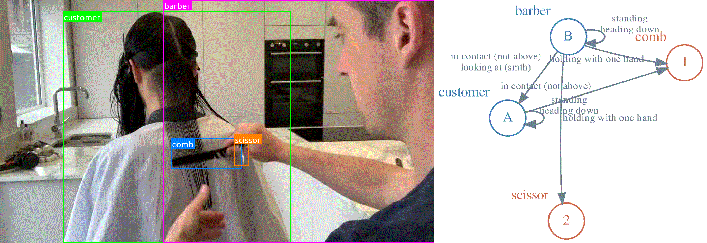
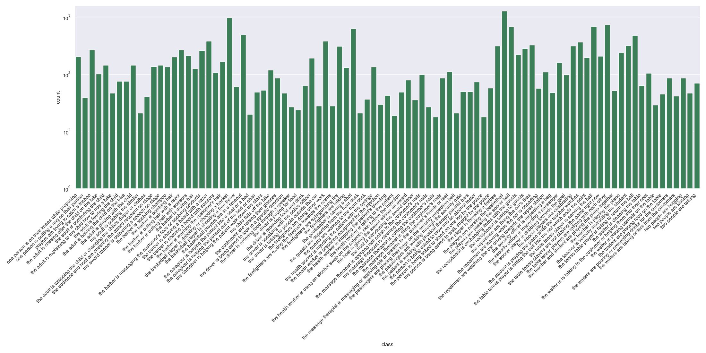
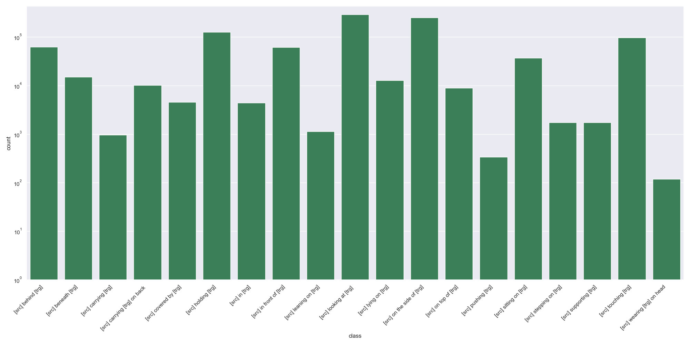
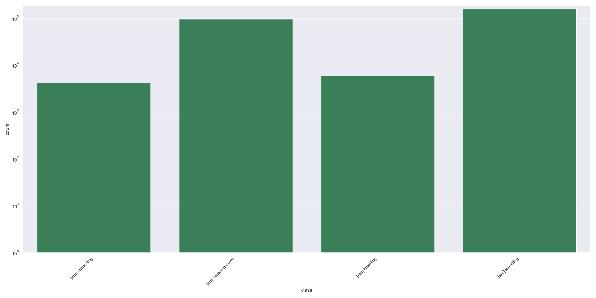
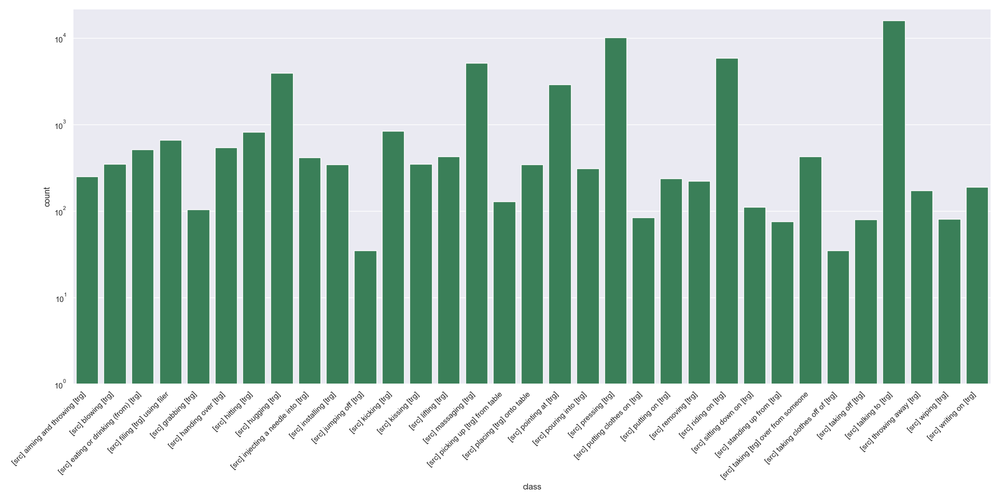
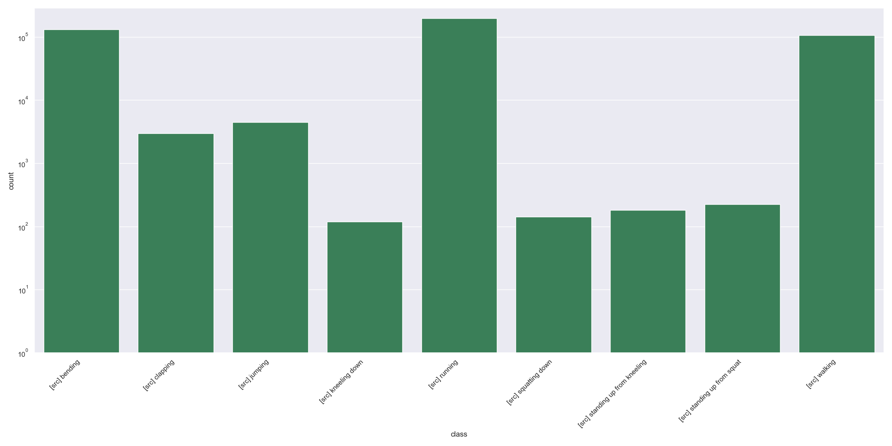

# MOMA-LRG

MOMA-LRG is a dataset dedicated to multi-object, multi-actor activity parsing.


## Installation

```
git clone https://github.com/d1ngn1gefe1/momatools
cd momatools
pip install .
```

You can install all the dependencies needed for MOMA-LRG by running

```
pip install -r requirements.txt
```

> **Warning**
>
> Note that the dependency on `pygraphviz` requires the installation of `graphviz`, which can be installed via `sudo apt-get install graphviz graphviz-dev` on Linux systems and `brew install graphviz` via [Homebrew](https://brew.sh/) on macOS.

#### Requirements:

- Python 3.7+
- ffmpeg (only for preprocessing): `pip install ffmpeg-python`
- jsbeautifier (for better visualization of json files): `pip install jsbeautifier`

#### Requirements: data visualization

- [distinctipy](https://github.com/alan-turing-institute/distinctipy): a lightweight package for generating visually distinct colors
- Graphviz: `sudo apt-get install graphviz graphviz-dev`
- PyGraphviz: a Python interface to the Graphviz graph layout and visualization package
- seaborn: a data visualization library based on matplotlib
- Torchvision

## Hierarchy

| Level | <div style="width:200px">Concept</div> | Representation                                                            |
| ----- | -------------------------------------- | ------------------------------------------------------------------------- |
| 1     | Activity                               | Semantic label                                                            |
| 2     | Sub-activity                           | Temporal boundary and semantic label                                      |
| 3     | Higher-order interaction               | Spatial-temporal scene graph                                              |
|       | ┗━&emsp;Entity                         | Graph node w/ bounding box, instance label, and semantic label            |
|       | &emsp;&emsp;┣━&emsp;Actor              | -                                                                         |
|       | &emsp;&emsp;┗━&emsp;Object             | -                                                                         |
|       | ┗━&emsp;Predicate                      | -                                                                         |
|       | &emsp;&emsp;┗━&emsp;Relationship       | Directed edge as a triplet (source node, semantic label, and target node) |
|       | &emsp;&emsp;┗━&emsp;Attribute          | Semantic label of a graph node as a pair (source node, semantic label)    |

## Dataset directory layout
Download the dataset into a directory titled `dir_moma` with the structure below. The `anns` directory requires roughly 1.8GB of space and the video directory requires 436 GB.

```
$ tree dir_moma
.
├── anns
│    ├── anns.json
│    ├── split_std.json
│    ├── split_fs.json
│    ├── clips.json
│    └── taxonomy
└── videos
     ├── all
     ├── raw
     ├── activity_fr
     ├── activity
     ├── sub_activity_fr
     ├── sub_activity
     ├── interaction
     ├── interaction_frames
     └── interaction_video
```

## Scripts

`tests/run_preproc.py`: Pre-process the dataset. Don't run this script since the dataset has been pre-processed.

`tests/run_visualize.py`: Visualize annotations and dataset statistics.

## Annotations

In this version, we include:

- 148 hours of videos
- 1,412 **activity** instances from [20 activity classes](https://raw.githubusercontent.com/d1ngn1gefe1/momatools/main/figures/activity.png?token=GHSAT0AAAAAABQHYNY25PBBGA4AIBT52DAAYPUG5AQ) ranging from 31s to 600s and with an average duration of 241s.
- 15,842 **sub-activity** instances from [91 sub-activity classes](https://raw.githubusercontent.com/d1ngn1gefe1/momatools/main/figures/sub_activity.png?token=GHSAT0AAAAAABQHYNY2CEGAIBK5KOSZLLPWYPUG6EQ) ranging from 3s to 31s and with an average duration of 9s.
- 161,265 **higher-order interaction** instances.
- 636,194 image **actor** instances and 104,564 video **actor** instances from [26 classes](https://raw.githubusercontent.com/d1ngn1gefe1/momatools/main/figures/actor.png?token=GHSAT0AAAAAABQHYNY3YODQHWF6ZEIKXHVGYPUG6WQ).
- 349,034 image **object** instances and 47,494 video **object** instances from [126 classes](https://raw.githubusercontent.com/d1ngn1gefe1/momatools/main/figures/object.png?token=GHSAT0AAAAAABQHYNY2S2BOY2KXIIHDBSPIYPUG6YA).
- 984,941 **relationship** instances from [19 classes](https://raw.githubusercontent.com/d1ngn1gefe1/momatools/main/figures/relationship.png?token=GHSAT0AAAAAABQHYNY3YR77CAOVI5JQBNZCYPUG7MA).
- 261,249 **attribute** instances from [4 classes](https://raw.githubusercontent.com/d1ngn1gefe1/momatools/main/figures/attribute.png?token=GHSAT0AAAAAABQHYNY2KBQJLZ5BPJH7EKIKYPUG7PQ).
- 52,072 **transitive action** instances from [33 classes](https://raw.githubusercontent.com/d1ngn1gefe1/momatools/main/figures/transitive_action.png?token=GHSAT0AAAAAABQHYNY3VTPGYBKO52XBPEUUYPUG7WQ).
- 442,981 **intransitive action** instances from [9 classes](https://raw.githubusercontent.com/d1ngn1gefe1/momatools/main/figures/intransitive_action.png?token=GHSAT0AAAAAABQHYNY2O4HYZFXUG3S7M5UMYPUG7XA).

Below, we show the syntax of the MOMA-LRG annotations.

```json5
[
  {
    "file_name": str,
    "num_frames": int,
    "width": int,
    "height": int,
    "duration": float,

    // an activity
    "activity": {
      "id": str,
      "class_name": str,
      "start_time": float,
      "end_time": float,

      "sub_activities": [
        // a sub-activity
        {
          "id": str,
          "class_name": str,
          "start_time": float,
          "end_time": float,

          "higher_order_interactions": [
            // a higher-order interaction
            {
              "id": str,
              "time": float,

              "actors": [
                // an actor
                {
                  "id": str,
                  "class_name": str,
                  "bbox": [x, y, width, height]
                },
                ...
              ],

              "objects": [
                // an object
                {
                  "id": str,
                  "class_name": str,
                  "bbox": [x, y, width, height]
                },
                ...
              ],

              "relationships": [
                // a relationship
                {
                  "class_name": str,
                  "source_id": str,
                  "target_id": str
                },
                ...
              ],

              "attributes": [
                // an attribute
                {
                  "class_name": str,
                  "source_id": str
                },
                ...
              ],

              "transitive_actions": [
                // a transitive action
                {
                  "class_name": str,
                  "source_id": str,
                  "target_id": str
                },
                ...
              ],

              "intransitive_actions": [
                // an intransitive action
                {
                  "class_name": str,
                  "source_id": str
                },
                ...
              ]
            }
          ]
        },
        ...
      ]
    }
  },
  ...
]
```

## Class distributions

### Activity


### Sub-activity



### Actor


### Object


### Relationship



### Attribute



### Transitive action



### Intransitive action


